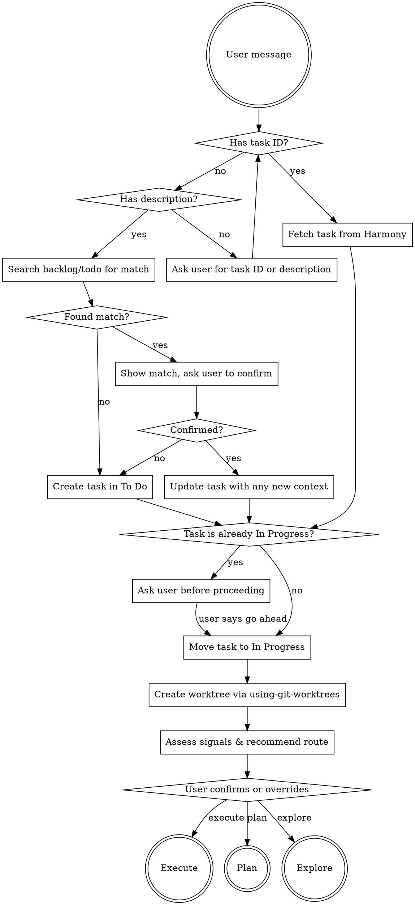

# Start Work

Set up everything needed to begin a piece of work: find or create the Harmony task, move it to In Progress, create an isolated worktree, and recommend an execution route (Execute, Plan, or Explore) based on task complexity and uncertainty.

## 0. Check project mode

Call `mcp__harmony__get_project`. If `mode !== 'opinionated'`, follow **Manual mode** (the original
flow below — unchanged). If `mode === 'opinionated'`, follow **Opinionated mode** instead.

---

## Opinionated mode (planning + building)

This path drives `planning` (Designed → Planned) and `building` (Planned → Built) for a ticket that has
accepted design decisions. It does NOT author design knowledge (build role): if you discover the accepted
design is wrong, do **not** quietly redesign and do **not** revert state yourself. Instead **raise a
revise-scope recommendation** — delegate to `/harmony-plugin:harmony-revise-scope <ticket> --to design`. That
skill drafts a `revise-scope-review` brief; on a **human accept** it supersedes the invalidated design
decision and reverts the ticket to `Decomposed` via `revising-decomposing` (from `Designed`, `Planned`, or
`Built`), after which design re-runs natively. The revert is **human-ratified** (contract-1) — never
auto-executed, even under `--unattended`. Do not call `advance_workflow` yourself to back up design
(`start-work` can't supersede design knowledge anyway — `record_decision`/`supersede_decision` are disallowed
here). Activity-name note: `revising-decomposing` (→`Decomposed`) re-opens **design**; the similarly-named
`revising-designing` (→`Designed`) re-opens the **plan** gate, not design — which is why the old recipe errored
from `Designed`. Both the plan-gate case (ticket at `Designed`) and the build-time `Planned`/`Built` case are
now supported (the latter via **B-609** — the `revise-scope --to design` guard accepts a build-state source and
the B-609 web migration seeds the `Planned`/`Built` → `revising-decomposing` → `Decomposed` back-edges).

### O1. Load + locate the ticket in the lifecycle

`mcp__harmony__get_task({ task_id })`. Branch on `workflow_state`:
- **Designed** → write the execution plan (next step), then build.
- **Planned** → the plan is accepted; go straight to build.
- Anything earlier → tell the user the ticket isn't ready to build (it needs clarify/decompose/design
  first) and suggest `/harmony-plugin:harmony-next`.

### O2. Plan (Designed → Planned)

Query `engineering` knowledge (`mcp__harmony__query_knowledge({ domain: ["engineering"] })`) and the
ticket's accepted design decisions (`query_knowledge({ status: "Accepted" })`). Write the execution plan
(invoke `superpowers:writing-plans` for anything non-trivial). File it as a plan brief:

```
mcp__harmony__compose_brief({
  task_id, reason: "plan-draft", pending_activity: "planning",
  doc: { decide: "Approve this execution plan?", items: [{ kind: "decision", text: "<plan summary>", recommendation: "proceed" }] }
})
```

On **accept** → `mcp__harmony__resolve_brief({ task_id, command: "accept" })` advances Designed→Planned.
The accept IS the "go" to build.

### O3. Build (Planned → Built)

Create the isolated worktree (invoke `superpowers:using-git-worktrees`) and save `.harmony-task.json`
exactly as in the manual flow. Implement, write tests, self-validate against acceptance criteria
(`mcp__harmony__manage_acceptance_criteria`, `mcp__harmony__manage_test_cases`).

**When the build completes, LAND the build evidence on the ticket BEFORE advancing — ORDERED &
NON-OPTIONAL (B-560).** Gates only advance `workflow_state`; a delegated/worktree build never touches the
ticket, so the evidence must be recorded here or it is lost (B-551 reached Verified with zero build trail).
Do these two steps, in order, before composing the release brief:

1. **Record the test cases** from the build's tests — `mcp__harmony__manage_test_cases({ task_id, add: [...] })`
   (one entry per test/spec the build added or relies on; `type: "integration"` / `"e2e"`).
2. **Check the acceptance criteria the build satisfies** — `mcp__harmony__manage_acceptance_criteria({ task_id, update: [{ id, checked: true }, ...] })`
   for each AC the work now meets (create any missing ACs first via `add`). By Built, the ACs the build
   satisfied should be checked.

(This is the canonical evidence the verify gate's mechanical evidence-status line reads — see
`get_build_evidence_status` and finish-work O3.) Then advance:

```
mcp__harmony__advance_workflow({ task_id, activity: "building" })   // Planned -> Built
```

Then file the release-decision brief (the ticket is now awaiting the human's release call). Note
`pending_activity: null` — the human's accept is the "go", but Built→Released is SYSTEM-on-deploy-success
(state-machine §6.1), advanced by the release path (`/harmony-plugin:finish-work`) *after* the deploy, not by the accept (review F4):

```
mcp__harmony__compose_brief({
  task_id, reason: "release-decision-pending", pending_activity: null,
  doc: { decide: "Release <ticket> to production?", items: [{ kind: "decision", text: "Ship the built artefact", recommendation: "release" }] }
})
```

Report that the ticket is Built and awaiting release; the human runs the **release gate** (`/harmony-plugin:finish-work`) — see `skills/harmony-shared/gate-routing.md` for the gate vocabulary.

---

## Manual mode

*(everything below is the original start-work flow — unchanged)*

## Flow



## Step-by-step

### 1. Identify the task

**If the user provided a Harmony task ID** (e.g., `B-123`):
- Fetch the task using `mcp__harmony__get_task` to understand what needs to be done.

**If the user described what they want but didn't give a task ID:**
- Use `mcp__harmony__list_tasks` to search the backlog and "To Do" statuses for a matching task.
- If you find a plausible match, show it to the user and ask: "Is this the right task?" along with the task details.
  - **User confirms:** Update the task description with any additional context from the conversation using `mcp__harmony__update_task`.
  - **User says no:** Create a new task in "To Do" status using `mcp__harmony__create_task` with the information the user provided.
- If no match is found, create a new task in "To Do" status.

**If the user provided neither:**
- Ask the user for a Harmony task ID or a description of what they want to do. Then proceed with the appropriate path above.

### 2. Check status and move to In Progress

- If the task is already **In Progress**, stop and ask the user before proceeding — someone else may be working on it.
- Otherwise, move the task to **In Progress** using `mcp__harmony__update_task`.

This happens BEFORE creating a worktree or branch.

### 3. Create worktree

Invoke the `superpowers:using-git-worktrees` skill to create an isolated workspace:
- Use the `.worktrees/` directory (it already exists and is gitignored).
- Name the branch descriptively based on the task (e.g., `feat/bulk-label-action` for a feature, `fix/login-redirect` for a bug).

After the worktree is created:

1. **Save task context** to `.harmony-task.json` in the worktree root. This file is gitignored and allows finish-work (and other steps) to reliably find the task without relying on conversation context.

```json
{
  "task_id": "uuid-here",
  "task_number": 123,
  "visual_id": "B-123",
  "title": "Task title from Harmony",
  "branch": "feat/branch-name"
}
```

2. **Annotate the task** with the branch name:

```
mcp__harmony__add_comment(task_id, "Started work on branch `feat/branch-name`")
```

### 4. Recommend execution route

After the worktree is ready, assess the task and recommend one of three routes. Use these signals (not a scoring system — just a judgment call):

**Signals that lean toward Execute:**
- Task description says exactly what to do ("add X to Y", "change A to B")
- Small, well-bounded scope (single file, one component, config change)
- Bug fixes with clear repro steps
- User said "just do it", "JFDI", "quick fix", or similar

**Signals that lean toward Plan:**
- Clear goal but multiple files/systems involved
- Task is well-specified but has several sequential steps
- Refactors, migrations, or anything where order matters
- User said "let's plan this" or "outline the approach"

**Signals that lean toward Explore:**
- Uncertainty language: "decide", "figure out", "should we", "explore", "investigate", "not sure", "options", "TBD", "what if"
- Task describes a problem without proposing a solution
- Vague or missing acceptance criteria
- User said "let's brainstorm", "I'm not sure how", or "let's think about this"

Present the recommendation concisely:

```
Ready to work on B-123: "Add bulk export to CSV"

I'd recommend **Plan** — the task is clear but touches the list view,
a new utility, and a download trigger.

→ [1] Execute — just do it
→ [2] Plan — outline steps, then execute
→ [3] Explore — brainstorm the approach first

Which route? (default: 2)
```

The user can reply with a number, a word, or just confirm the default.

### 5. Display acceptance criteria

After fetching the task, check for acceptance criteria:
- If `get_task` returns acceptance criteria items, display them as part of the execution context:
  ```
  This task has N acceptance criteria to address:
  - [ ] criterion 1
  - [ ] criterion 2
  ```
- In the Execute handoff instructions, include:
  - Check off AC items via `manage_acceptance_criteria` as you address them
  - After writing tests, record them via `manage_test_cases` before creating a PR

### 6. Hand off to the chosen route

**Execute:** Start implementing immediately. Do the work, write tests, commit, and create a PR ready for the user to review.

**Plan:** Enter plan mode. Write a structured outline of the approach — what files change, in what order, what the key decisions are. Wait for the user to approve or adjust, then execute the plan.

**Explore:** Invoke the `superpowers:brainstorming` skill. Follow its full flow (clarifying questions → approach options → design → spec). The brainstorming skill will naturally transition to planning and then implementation when the design is approved.

---

## Task lifecycle

This is the authoritative reference for Harmony task status transitions. Follow this automatically throughout the development workflow — don't wait to be asked.

| Event | Status transition | Annotation |
|-------|-------------------|------------|
| Starting work (this skill) | → **In Progress** | Comment: branch name |
| Creating a PR | → **In Review** | Comment: PR URL |
| PR merged (finish-work skill) | → **Done** | Comment: merge confirmation |

### When creating a PR

Whenever you push a branch and create a pull request (whether during Execute, after a Plan, or at any other point), you MUST:

1. Read the task ID from `.harmony-task.json` in the worktree root
2. Move the Harmony task to **In Review** using `mcp__harmony__update_task`
3. Add a comment with the PR URL using `mcp__harmony__add_comment`:

```
mcp__harmony__add_comment(task_id, "PR created: <url>")
```

This applies regardless of which execution route was chosen. The task should be a living record of what happened.
