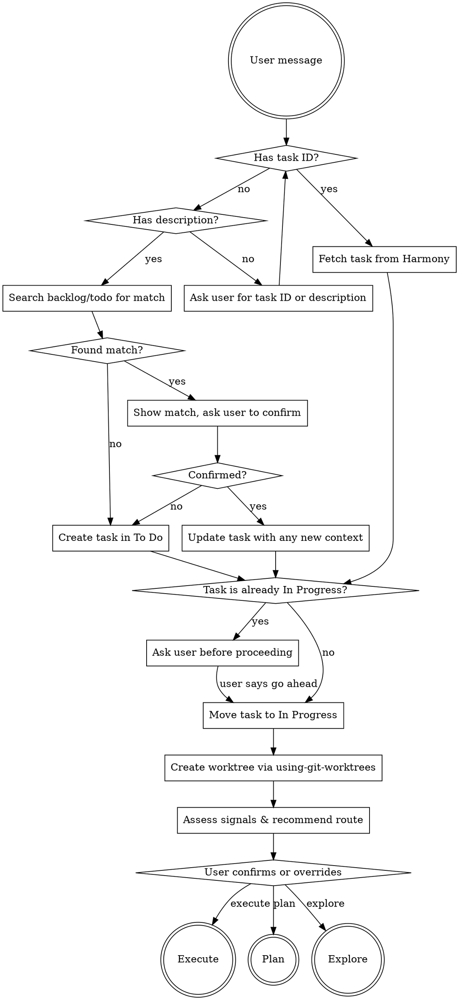

# Start Work

Set up everything needed to begin a piece of work: find or create the Harmony task, move it to In Progress, create an isolated worktree, and recommend an execution route (Execute, Plan, or Explore) based on task complexity and uncertainty.

## 0. Check project mode

Call `mcp__harmony__get_project`. If `mode !== 'opinionated'`, follow **Manual mode** (the original
flow below — unchanged). If `mode === 'opinionated'`, follow **Opinionated mode** instead.

---

## Opinionated mode (planning + building)

In opinionated mode the usual entry point is `/harmony-plugin:harmony-conduct`, which drives the whole gate sequence and delegates the plan/build gates to this section; invoking start-work directly runs just these gates.

This path drives `planning` (Designed → Planned) and `building` (Planned → Built) for a ticket that has
accepted design decisions. It does NOT author design knowledge (build role): if you discover the accepted
design is wrong, do **not** quietly redesign and do **not** revert state yourself. (This is one instance of a
standing rule, for a future reader's context: an agent may never perform a gate's work from outside that
gate — see `skills/harmony-shared/gate-routing.md` §Reopen to a target gate. `start-work` is only ever invoked
for its own gate via the existing routing table, so it has no path to improvise another gate's work; this is
just the design-specific case of that rule.) Instead **raise a
revise-scope recommendation** — delegate to `/harmony-plugin:harmony-revise-scope <ticket> --to design`. That
skill drafts a `revise-scope-review` brief; on a **human accept** it supersedes the invalidated design
decision and reverts the ticket to `Decomposed` via `revising-decomposing` (from `Designed`, `Planned`, or
`Built`), after which design re-runs natively. The revert is **human-ratified** (contract-1) — never
auto-executed, even under `--unattended`. Do not call `advance_workflow` yourself to back up design
(`start-work` can't supersede design knowledge anyway — `record_decision`/`supersede_decision` are disallowed
here). Activity-name note: `revising-decomposing` (→`Decomposed`) re-opens **design**; the similarly-named
`revising-designing` (→`Designed`) re-opens the **plan** gate, not design — which is why the old recipe errored
from `Designed`. Both the plan-gate case (ticket at `Designed`) and the build-time `Planned`/`Built` case are
now supported (the latter via **B-609** — the `revise-scope --to design` guard accepts a build-state source and
the B-609 web migration seeds the `Planned`/`Built` → `revising-decomposing` → `Decomposed` back-edges).

### O1. Load + locate the ticket in the lifecycle

`mcp__harmony__get_task({ task_id })`. Branch on `workflow_state`:
- **Designed** → write the execution plan (next step), then build.
- **Planned** → the plan is accepted; go straight to build.
- Anything earlier → tell the user the ticket isn't ready to build (it needs clarify/decompose/design
  first) and suggest `/harmony-plugin:harmony-next`.

### O2. Plan (Designed → Planned)

Query `engineering` knowledge (`mcp__harmony__query_knowledge({ domain: ["engineering"] })`) and the
ticket's accepted design decisions (`query_knowledge({ status: "Accepted" })`). Write the execution plan
(invoke `superpowers:writing-plans` for anything non-trivial). Author the brief per
`skills/harmony-shared/brief-authoring.md` §Plan — the question, must-haves, and engagement it owes the
human, plus the legibility contract. Consult it; do not restate it. File it as a plan brief:

```
mcp__harmony__compose_brief({
  task_id, reason: "plan-draft", pending_activity: "planning",
  doc: { decide: "Approve this execution plan?", items: [{ kind: "decision", text: "<plan summary>", recommendation: "proceed" }] }
})
```

On **accept** → `mcp__harmony__resolve_brief({ task_id, command: "accept", provenance: "human-in-session" })`
advances Designed→Planned. The accept IS the "go" to build.

> **Provenance (B-734):** `human-in-session` is the human deciding *here* — a conductor-synthesized accept
> carries `agent-synthesized:<mode>` through this same path (`skills/harmony-shared/gate-routing.md`
> §Resolution provenance).
**discuss <remark>** → open a discussion on this brief per `skills/harmony-shared/elicitation-engine.md` §The discuss trigger (resolution suspends until it concludes).
**A staged `pending_resolution` you can only partially apply** → apply what you structurally can, then file a `worker-question` round scoped to the blocked residue per `skills/harmony-shared/elicitation-engine.md` §Resuming onto a staged pending_resolution you can only partially apply (file the round before recomposing — crash-safety ordering, never wholesale-discard an actionable resolution).

### O3. Build (Planned → Built)

**FIRST — PRE-CHECK the acceptance-criteria floor, BEFORE any build work begins (B-747). NON-OPTIONAL,
and the position in this step is load-bearing.**

```
const ev = mcp__harmony__get_build_evidence_status({ task_id })
```

`ev.has_acceptance_criteria` is PRESENCE only — at least one criterion, checked state irrelevant. It is
read from the same SQL authority (`task_criteria_floor_status`) that the substrate transition guard calls,
so the floor cannot mean two different things in two places. It is deliberately NOT `all_acs_checked`:
that stricter predicate is B-560's deferred evidence test and would refuse every legitimately in-progress
build.

- **`ev.has_acceptance_criteria` true, or `ev.exempt_reason` non-null** (umbrella / `decision-only`) →
  proceed with the build below.
- **Otherwise → STOP HERE. Do not create a worktree, do not implement, do not commit, do not open a PR.**
  Open an **elicitation round** asking the human for the criteria (`start_elicitation` with
  `gate: 'building'` + `file_elicitation_round`), naming what is missing, and end the leg. Answering it
  lets the run continue with no manual repair.

**WHY THIS IS FIRST, and not next to the advance.** A ticket with no acceptance criteria has nothing the
shipped work could be judged against, so **the point is to prevent the work, not to record that it
happened.** B-698 is the cost — 1,358 lines built against a single-button criterion. The substrate guard
sits on the `Planned→Built` edge, which fires only *after* the build has run: it reliably stops the
**escape**, but by then the effort is already spent. These are two different placements doing two
different jobs, and the start-of-build check is the one that saves the work. Moving this block down next
to the advance silently collapses the pair into one late check and reintroduces exactly the waste the
floor exists to prevent.

**Why pre-check rather than let the transition fail.** The DB guard refuses by RAISING, and neither
`advance_workflow` nor `resolve_brief` catches it — the exception surfaces as an opaque tool error. In a
daemon leg an uncaught refusal is a **dirty exit**, so the daemon parks the conduction and flags an
operator, turning "this ticket needs criteria" into an incident. The pre-check is what makes the floor
answerable; the guard is the backstop for paths that skip it. Never swallow the guard's error as a
substitute for checking first.

Then, with the floor clear: create the isolated worktree (invoke `superpowers:using-git-worktrees`) and
save `.harmony-task.json`
exactly as in the manual flow. Implement, write tests, self-validate against acceptance criteria
(`mcp__harmony__manage_acceptance_criteria`, `mcp__harmony__manage_test_cases`).

**Build delegation is CONDITIONAL on the declared build agent (B-719).** The implementation runs in a
build subagent (context-thinning; worktree per B-628) — WHICH subagent depends on what the session has:

- **`harmony-build` available** (`test -f ~/.claude/agents/harmony-build.md` — provisioned in the build
  container) → delegate the implementation to it **BY NAME**. Its declared frontmatter
  `permissionMode: bypassPermissions` is the only lever that reaches a subagent in headless `-p`
  (B-719 minimal repros); config levers (the CLI flag, settings `defaultMode`, `dontAsk`) all fail.
- **Absent AND `HARMONY_BUILD_CONTAINER` is set** (the image-baked container marker) → the container is
  MISPROVISIONED: `mcp__harmony__add_comment` "Build agent not provisioned — ~/.claude/agents/harmony-build.md
  missing in the build container" and `mcp__harmony__advance_workflow({ activity: 'parking' })`. Do NOT
  attempt the ad-hoc build — its Edit/Write will be denied and the run dies mid-build with no clear cause.
- **Absent, no marker** (every human machine) → today's behavior, unchanged: the ordinary ad-hoc build
  subagent. The bypass agent never lands on a human machine (B-719 design: container-only).

**Parse `harmony-build`'s final report for a `WORKER-QUESTION:` marker (B-733) — before treating it as
a completed or failed build.** `harmony-build` has no MCP tool access, so it cannot file an elicitation
round itself; when it hits a genuine judgment-call question or a capability denial mid-build it stops
working and ends its report with the literal fenced marker:
```
WORKER-QUESTION: <judgment-call|capability-denial>
<the question / the denied tool + target + redirect options>
```
On seeing this literal string, do NOT treat the subagent's return as done or failed — call
`mcp__harmony__start_elicitation({ task_id, trigger: 'worker-question', gate: 'building' })` then
`mcp__harmony__file_elicitation_round` naming `harmony-build` as the source in the round's context line
and quoting the marker's content as the question. Then end the turn — the round is a clean human pause
(per `skills/harmony-shared/elicitation-engine.md` §The worker-question trigger), not a build failure.

**Verify the base before building (B-585) — NON-OPTIONAL for a redefine or a "relative-to-today" change.**
Before a `CREATE OR REPLACE` of a DB function / trigger / view that has been redefined across migrations, find
the **LIVE** body: grep every migration for `CREATE OR REPLACE FUNCTION <name>` → the **LAST by timestamp** is
the base to rebase onto (never copy an arbitrary older one). A green test on a stale base is a **false
negative** — add a regression assertion for the preserved-but-otherwise-untested behavior. This generalizes:
whenever a ticket is scoped *relative to* "how it works today" (a fix / refinement / "unchanged elsewhere"
claim), **READ the current code to confirm that baseline before building** — the spec's premise about the
status quo is frequently wrong, and the build gate is where to catch it (sharpens `a58907f1` — plans grounded
against real code, never from memory).

**When the tests pass, PRODUCE THE ARTEFACT — the ordered commit→push→verify→PR→record step (B-722,
NON-OPTIONAL).** A build is not done when its tests pass; it is done when the tested work exists as a
real, pushed, open PR. A conducted ticket must NEVER reach the release gate without one — B-713 composed
a "Ship the built artefact" release brief with zero persisted code, and the `--rm` container discarded
the work. Run these sub-steps in order; on ANY sub-step failure go to the FAILURE PATH below — never
advance past a failed sub-step:

1. **Commit + push the ticket branch.** In a delegated build, INSTRUCT the build subagent to commit and
   push — the `harmony-build` agent is deliberately "push only when instructed" (B-719), and O3 is the
   instructing party. In a main-loop build, run the commit + push yourself.
2. **Verify the push landed:** `git ls-remote origin <branch>` must show the branch at the expected head
   SHA. An un-pushed commit is not an artefact.
3. **Open the PR:** `gh pr create` (base `main`), then verify it is open — `gh pr view <url> --json state,url`
   must report `OPEN`.
4. **Record the structured pushed-PR reference on the ticket** — written ONLY from the just-verified
   live outputs of sub-steps 2–3, never from intent. **Include the PR's AUTHOR IDENTITY (B-732)**:
   read it from the same `gh pr view <pr_number> --json state,url,author` call that verified the PR is
   open, and record `author_is_bot` + `author_login`. This is what makes the release brief's approval
   requirement mechanically enforceable — `compose_brief` reads `build_pr.author_is_bot` and REJECTS a
   bot-authored release brief that omits the approval line. Omit it and the guard silently cannot fire.
   ```
   mcp__harmony__update_task({ task_id, field_values: { build_pr: {
     branch, head_sha, pr_number, pr_url, base: "main", opened_at,
     author_login, author_is_bot
   } } })
   ```
   The record IS the verification: `get_build_evidence_status` keys `has_pushed_pr` (and therefore
   `complete`) on this reference, so a ticket with no verified PR mechanically reads incomplete at the
   verify gate. `update_task` merges `field_values` — other keys are preserved.
5. **Comment the PR URL** for the human trail: `mcp__harmony__add_comment(task_id, "PR created: <url>")`.

**FAILURE PATH — preserve the work, then park; NEVER a PR-less release brief (B-722).** On ANY failure
of commit / push / PR-create (permission denial, network, auth, `gh` outage), run this IN THE WORKER,
BEFORE the session or container exits — an ephemeral `--rm` worker that exits first discards the work:

1. **Generate the patch FIRST** — `git diff HEAD` (plus `git diff --staged` when staging succeeded) into
   a patch file. Diffing is a READ: it works even when `git commit` itself was denied (B-668).
2. **Upgrade to a WIP branch when a commit exists** — `git push origin HEAD:wip/B-<n>` with whatever
   creds succeed. Under commit-denial no commit exists, so this rung is skipped, not retried.
3. **Attach the patch when the WIP push rung failed** — `mcp__harmony__attach_file({ task_id, file_path })`
   with the patch file. Preservation must succeed by ONE of the two rungs before proceeding.
4. **Comment the park contract** — `mcp__harmony__add_comment`: which sub-step failed (commit vs push vs
   PR-create), the preservation form + location (WIP branch name, or attachment filename), and the
   test/AC state at failure — resume-ready without forensics.
5. **Park:** `mcp__harmony__advance_workflow({ task_id, activity: "parking" })`. The ticket NEVER
   advances to Built and NEVER composes a release brief without the recorded `build_pr` reference.

**Then LAND the build evidence on the ticket BEFORE advancing — ORDERED & NON-OPTIONAL (B-560).** Gates
only advance `workflow_state`; a delegated/worktree build never touches the ticket, so the evidence must
be recorded here or it is lost (B-551 reached Verified with zero build trail). By now the artefact step
has already recorded `build_pr` and commented the PR URL. Do these two steps, in order, before composing
the release brief:

1. **Record the test cases** from the build's tests — `mcp__harmony__manage_test_cases({ task_id, add: [...] })`
   (one entry per test/spec the build added or relies on; `type: "integration"` / `"e2e"`).
2. **Check the acceptance criteria the build satisfies** — `mcp__harmony__manage_acceptance_criteria({ task_id, update: [{ id, checked: true }, ...] })`
   for each AC the work now meets (create any missing ACs first via `add`). By Built, the ACs the build
   satisfied should be checked.

(This is the canonical evidence the verify gate's mechanical evidence-status line reads — see
`get_build_evidence_status` and finish-work O3.)

**The floor was already checked at the TOP of this step (B-747) — deliberately not here.** A ticket with
no acceptance criteria never reaches this point, because the check that stops it runs before any build
work begins. Do NOT re-add a floor check next to the advance: the substrate guard already covers this
edge, and duplicating the check here while dropping the early one is precisely the regression that made
the floor record wasted work instead of preventing it.

Then advance:

```
mcp__harmony__advance_workflow({ task_id, activity: "building" })   // Planned -> Built
```

Then file the release-decision brief (the ticket is now awaiting the human's release call). Author the
brief per `skills/harmony-shared/brief-authoring.md` §Release — the question, must-haves, and engagement
it owes the human, plus the legibility contract. Consult it; do not restate it. Note
`pending_activity: null` — the human's accept is the "go", but Built→Deployed is SYSTEM-on-deploy-success
(state-machine §6.1), advanced by the release path (`/harmony-plugin:finish-work`) *after* the deploy, not by the accept (review F4):

The release brief must reference the recorded PR — the human's "ship it" points at a real, verifiable
artefact (read `branch` / `pr_url` back from `field_values.build_pr`):

**Query the PR's identity and review state at COMPOSE time — never assume (B-732).** Before composing,
read both signals off the PR you just recorded:

```
gh pr view <pr_number> --json author,reviewDecision
```

**If `author.is_bot` is true** (a daemon-built PR authored by the `harmony-daemon` App), the brief MUST
say that a human approval on GitHub is required before the merge can happen, name the PR, and surface
the current `reviewDecision`. GitHub forbids a PR author approving its own PR, so the worker cannot
merge it alone — a brief that omits this walks the human into accepting a release that then cannot
proceed. **`compose_brief` enforces this**: a bot-authored `build_pr` whose brief says nothing about the
approval requirement is REJECTED by the lint, so this is not optional and cannot be forgotten.
(B-738 shipped exactly that brief — its whole ask was "Release B-738 … to production?" — and the run
only went smoothly because the founder had been told out-of-band to approve first.)

**Say "to staging", not "to production".** Merging to `main` deploys to **staging**; production is a
separate, deliberate `./promote-prod.sh` step (workspace CLAUDE.md → Deploy & Environments). The old
wording conflated the two (the B-726 read-plane/deploy-plane conflation).

```
mcp__harmony__compose_brief({
  task_id, reason: "release-decision-pending", pending_activity: null,
  doc: { decide: "Release <ticket> — merge PR <pr_number> and deploy to staging?",
    context: [
      "PR: <pr_url> (branch <branch>, head <head_sha>)",
      // BOT-AUTHORED ONLY — omit this line for a founder-authored PR:
      "⚠ This PR is authored by <author.login> and needs your approval on GitHub before it can merge: <pr_url>. Current reviewDecision: <reviewDecision>. Accepting here is your go-ahead; the merge runs once the approval lands.",
    ],
    items: [{ kind: "decision", text: "Ship the built artefact — PR <pr_url>", recommendation: "release" }] }
})
```

Report that the ticket is Built and awaiting release; the human runs the **release gate** (`/harmony-plugin:finish-work`) — see `skills/harmony-shared/gate-routing.md` for the gate vocabulary.

---

## Manual mode

*(everything below is the original start-work flow — unchanged)*

## Flow


```dot
digraph start_work {
    "User message" [shape=doublecircle];
    "Has task ID?" [shape=diamond];
    "Has description?" [shape=diamond];
    "Ask user for task ID or description" [shape=box];
    "Fetch task from Harmony" [shape=box];
    "Search backlog/todo for match" [shape=box];
    "Found match?" [shape=diamond];
    "Show match, ask user to confirm" [shape=box];
    "Confirmed?" [shape=diamond];
    "Update task with any new context" [shape=box];
    "Create task in To Do" [shape=box];
    "Task is already In Progress?" [shape=diamond];
    "Ask user before proceeding" [shape=box];
    "Move task to In Progress" [shape=box];
    "Create worktree via using-git-worktrees" [shape=box];
    "Assess signals & recommend route" [shape=box];
    "User confirms or overrides" [shape=diamond];
    "Execute" [shape=doublecircle];
    "Plan" [shape=doublecircle];
    "Explore" [shape=doublecircle];

    "User message" -> "Has task ID?";
    "Has task ID?" -> "Fetch task from Harmony" [label="yes"];
    "Has task ID?" -> "Has description?" [label="no"];
    "Has description?" -> "Search backlog/todo for match" [label="yes"];
    "Has description?" -> "Ask user for task ID or description" [label="no"];
    "Ask user for task ID or description" -> "Has task ID?";
    "Search backlog/todo for match" -> "Found match?";
    "Found match?" -> "Show match, ask user to confirm" [label="yes"];
    "Found match?" -> "Create task in To Do" [label="no"];
    "Show match, ask user to confirm" -> "Confirmed?";
    "Confirmed?" -> "Update task with any new context" [label="yes"];
    "Confirmed?" -> "Create task in To Do" [label="no"];
    "Update task with any new context" -> "Task is already In Progress?";
    "Create task in To Do" -> "Task is already In Progress?";
    "Fetch task from Harmony" -> "Task is already In Progress?";
    "Task is already In Progress?" -> "Ask user before proceeding" [label="yes"];
    "Task is already In Progress?" -> "Move task to In Progress" [label="no"];
    "Ask user before proceeding" -> "Move task to In Progress" [label="user says go ahead"];
    "Move task to In Progress" -> "Create worktree via using-git-worktrees";
    "Create worktree via using-git-worktrees" -> "Assess signals & recommend route";
    "Assess signals & recommend route" -> "User confirms or overrides";
    "User confirms or overrides" -> "Execute" [label="execute"];
    "User confirms or overrides" -> "Plan" [label="plan"];
    "User confirms or overrides" -> "Explore" [label="explore"];
}
```

## Step-by-step

### 1. Identify the task

**If the user provided a Harmony task ID** (e.g., `B-123`):
- Fetch the task using `mcp__harmony__get_task` to understand what needs to be done.

**If the user described what they want but didn't give a task ID:**
- Use `mcp__harmony__list_tasks` to search the backlog and "To Do" statuses for a matching task.
- If you find a plausible match, show it to the user and ask: "Is this the right task?" along with the task details.
  - **User confirms:** Update the task description with any additional context from the conversation using `mcp__harmony__update_task`.
  - **User says no:** Create a new task in "To Do" status using `mcp__harmony__create_task` with the information the user provided.
- If no match is found, create a new task in "To Do" status.

**If the user provided neither:**
- Ask the user for a Harmony task ID or a description of what they want to do. Then proceed with the appropriate path above.

### 2. Check status and move to In Progress

- If the task is already **In Progress**, stop and ask the user before proceeding — someone else may be working on it.
- Otherwise, move the task to **In Progress** using `mcp__harmony__update_task`.

This happens BEFORE creating a worktree or branch.

### 3. Create worktree

Invoke the `superpowers:using-git-worktrees` skill to create an isolated workspace:
- Use the `.worktrees/` directory (it already exists and is gitignored).
- Name the branch descriptively based on the task (e.g., `feat/bulk-label-action` for a feature, `fix/login-redirect` for a bug).

After the worktree is created:

1. **Save task context** to `.harmony-task.json` in the worktree root. This file is gitignored and allows finish-work (and other steps) to reliably find the task without relying on conversation context.

```json
{
  "task_id": "uuid-here",
  "task_number": 123,
  "visual_id": "B-123",
  "title": "Task title from Harmony",
  "branch": "feat/branch-name"
}
```

2. **Annotate the task** with the branch name:

```
mcp__harmony__add_comment(task_id, "Started work on branch `feat/branch-name`")
```

### 4. Recommend execution route

After the worktree is ready, assess the task and recommend one of three routes. Use these signals (not a scoring system — just a judgment call):

**Signals that lean toward Execute:**
- Task description says exactly what to do ("add X to Y", "change A to B")
- Small, well-bounded scope (single file, one component, config change)
- Bug fixes with clear repro steps
- User said "just do it", "JFDI", "quick fix", or similar

**Signals that lean toward Plan:**
- Clear goal but multiple files/systems involved
- Task is well-specified but has several sequential steps
- Refactors, migrations, or anything where order matters
- User said "let's plan this" or "outline the approach"

**Signals that lean toward Explore:**
- Uncertainty language: "decide", "figure out", "should we", "explore", "investigate", "not sure", "options", "TBD", "what if"
- Task describes a problem without proposing a solution
- Vague or missing acceptance criteria
- User said "let's brainstorm", "I'm not sure how", or "let's think about this"

Present the recommendation concisely:

```
Ready to work on B-123: "Add bulk export to CSV"

I'd recommend **Plan** — the task is clear but touches the list view,
a new utility, and a download trigger.

→ [1] Execute — just do it
→ [2] Plan — outline steps, then execute
→ [3] Explore — brainstorm the approach first

Which route? (default: 2)
```

The user can reply with a number, a word, or just confirm the default.

### 5. Display acceptance criteria

After fetching the task, check for acceptance criteria:
- If `get_task` returns acceptance criteria items, display them as part of the execution context:
  ```
  This task has N acceptance criteria to address:
  - [ ] criterion 1
  - [ ] criterion 2
  ```
- In the Execute handoff instructions, include:
  - Check off AC items via `manage_acceptance_criteria` as you address them
  - After writing tests, record them via `manage_test_cases` before creating a PR

### 6. Hand off to the chosen route

**Execute:** Start implementing immediately. Do the work, write tests, commit, and create a PR ready for the user to review.

**Plan:** Enter plan mode. Write a structured outline of the approach — what files change, in what order, what the key decisions are. Wait for the user to approve or adjust, then execute the plan.

**Explore:** Invoke the `superpowers:brainstorming` skill. Follow its full flow (clarifying questions → approach options → design → spec). The brainstorming skill will naturally transition to planning and then implementation when the design is approved.

---

## Task lifecycle

This is the authoritative reference for Harmony task status transitions. Follow this automatically throughout the development workflow — don't wait to be asked.

| Event | Status transition | Annotation |
|-------|-------------------|------------|
| Starting work (this skill) | → **In Progress** | Comment: branch name |
| Creating a PR | → **In Review** | Comment: PR URL |
| PR merged (finish-work skill) | → **Done** | Comment: merge confirmation |

### When creating a PR

Whenever you push a branch and create a pull request (whether during Execute, after a Plan, or at any other point), you MUST:

1. Read the task ID from `.harmony-task.json` in the worktree root
2. Move the Harmony task to **In Review** using `mcp__harmony__update_task`
3. Add a comment with the PR URL using `mcp__harmony__add_comment`:

```
mcp__harmony__add_comment(task_id, "PR created: <url>")
```

This applies regardless of which execution route was chosen. The task should be a living record of what happened.
